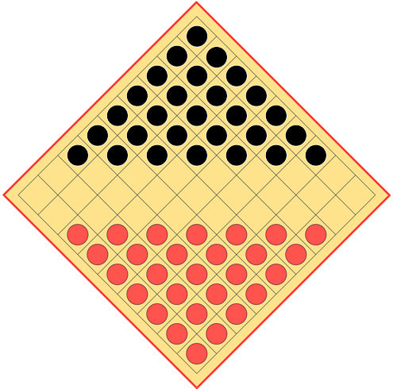
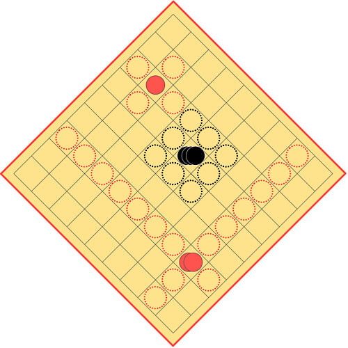
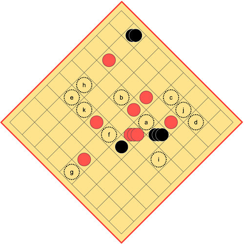

Original rules

Here now are the original rules of Fenix, as recorded by my game friend David Parlett.

1. Strike is played on a board of 81 squares (9x9) with 56 pieces divided into two sets of 28 pieces of different colours, conventionally red and black. 
                           
2. At the start of each game the pieces are arranged as shown below: 

3. Red starts and the turn to play alternates. A piece once touched must be played.

4. Each player, on their first five turns, uses some of their own pieces to create one King and three Generals [the latter alternatively called "Councillors"], in any preferred order. A General is made by placing any single piece on top of an orthogonally adjacent piece, and a King is made by placing any single piece on top of an orthogonally adjacent General. After the first five turns you will therefore possess: 1 King (a stack of three pieces); 3 Generals (stacks of two pieces each); and 19 Soldiers (singletons).

5. To continue, Red starts by moving a Soldier, a General, or his King.

    - Soldiers move orthogonally one step to an adjacent square.
    - Generals move any distance in a straight line orthogonally, like a Chess Rook.
    - The King moves one step to any adjacent square, like a Chess King. 

These moves are subject to the rule that no piece may land on another, and a General can only pass over empty squares (in a non-capturing move).

6. Capture is compulsory if possible.

    - A Soldier or King captures by jumping over an enemy piece occupying a square to which it can legally move and landing on the square immediately beyond it in the same direction, provided that the landing square is vacant.
    - A General captures in the same way, but may move any number of vacant squares before the captured piece, and  may land on any successive vacant square in line of travel beyond the captured piece.

If the capturing piece can then make another capture, it must, and it must continue doing so until all possible consecutive captures have been made. An enemy piece can only be jumped once in a single turn. If it is reached a second time it forms a block and ends the turn. At the end of a capturing turn all captured pieces must be removed from the board before the next player moves.

7. If more than one capture is possible you must choose that which captures the greatest number of pieces, counting a King as three, a General as two, and a Soldier as one. If two possible capturing moves offer an equal number of pieces, you may freely choose between them.
Picture

The black Soldier can capture a King and Soldier by jumping to a then b. The Soldier cannot continue capturing to c because it does not move diagonally. The black General has a possible capture of three Soldiers by jumping to e, f, and g; however, alternatively the black General can capture a Soldier and King by moving to h and i, say; the latter option must be taken, because it results in four pieces captured, rather than three, even though there are fewer jumps. The black King can capture a single Soldier by jumping to j; however, it can also capture King and Soldier by jumping to f and k; this latter option must be selected.
8. If one or more of your Generals is captured in one turn, you may use your next turn to create just one General (not more) from two orthogonally adjacent Soldiers anywhere on the board. However, you may not also move in the same turn. If you do move, instead of creating another General, then the right to create a General is lost.

9. If your King is captured you must, if possible, use your next turn to create another King by placing a Soldier on top of an adjacent General. This counts as a turn, and it prevents you from creating another General if one or more was taken in the same turn as the King.  [To clarify, re-instantiating a General or King takes precedence over a capture; the capture would otherwise be compulsory. ~ Ed.]

10. If you are unable to create another King, when your King is captured, you lose the game.

11. You also lose if you repeat the same sequence of moves for the third time.

12. If neither player can capture the other’s King, the game is drawn.
​
